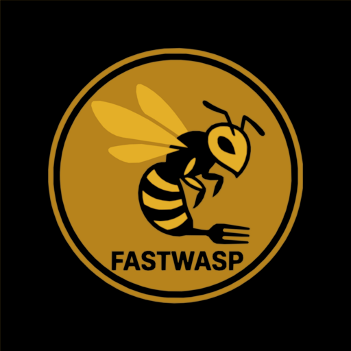

<div align="center">
  
  <h1>Fast Wasp</h1>
  <p><em>Intermittent fasting tracker. With a sting.</em></p>
</div>

---

A free, offline-first Progressive Web App for tracking intermittent fasting, weight and craving resistance — no account, no ads, all data stored locally in your browser.

---

## Features

| Feature | Details |
|---------|---------|
| ⏱ **Fast Tracking** | Live countdown timer, overtime tracking, full history |
| 🍽 **Eating Window** | Auto-starts after each fast; countdown + overtime for the eating window too |
| 📋 **Programs** | 12:12, 14:10, 16:8, 18:6, 20:4, OMAD, or custom duration |
| ⚖ **Weight Tracking** | Log entries, line chart (1M/3M/6M/All), delta & % over 3 months |
| 🍬 **Sweets Panic Button** | Tap instead of reaching for snacks — streaks, daily/weekly/monthly stats, 30-day heatmap |
| 🔒 **Local-first** | 100% localStorage — data never leaves your device |
| 📴 **Offline** | Works without internet after first load (Service Worker) |
| 📲 **Installable** | Add to Home Screen on iOS/Android; runs as a standalone app |
| 🚫 **Zero ads** | Ever |

---

## Tech Stack

- **Vanilla HTML/CSS/JS** (ES modules) — no build step
- **Chart.js 4** + `chartjs-adapter-date-fns` via CDN for the weight chart
- **Service Worker** for offline / PWA
- Hosted statically on **GitHub Pages**

---

## Local Development

```bash
# Clone
git clone https://github.com/yourusername/fast-fast.git
cd fast-fast

# Serve locally (Service Workers need http://, not file://)
python3 -m http.server 8080
# then open http://localhost:8080/
```

No build step needed — edit and refresh.

---

## Deploy to GitHub Pages

Pushes to `main` automatically deploy via **GitHub Actions** to the `deploy` branch.

To set up:
1. Push to `main`
2. Go to **Settings → Pages** in your GitHub repo
3. Set source: **Deploy from a branch** → branch: `deploy` → folder: `/ (root)`
4. Done — your app will be live at `https://yourusername.github.io/fast-fast/`

> **Note:** Update the canonical URL in `index.html` (three `yourusername` placeholders) after setting up your repo.

---

## Data Model

All data stored in `localStorage` under the `fastfast.v1.*` namespace:

| Key | Contents |
|-----|----------|
| `settings` | `{ name, unit, selectedProgramId, customHours }` |
| `activeFast` | Current fast `{ startedAt, targetHours, eatHours, programId }` |
| `fastHistory` | Array of completed fasts with actual/overtime hours |
| `activeConsumption` | Current eating window `{ startedAt, targetHours, programId }` |
| `consumptionHistory` | Array of completed eating windows |
| `weights` | Array of `{ id, at, kg }` — always stored in kg |
| `cravings` | Array of craving resistance events `{ id, at }` |
| `omad` / `omadHistory` | OMAD meal log |

---

## License

MIT
